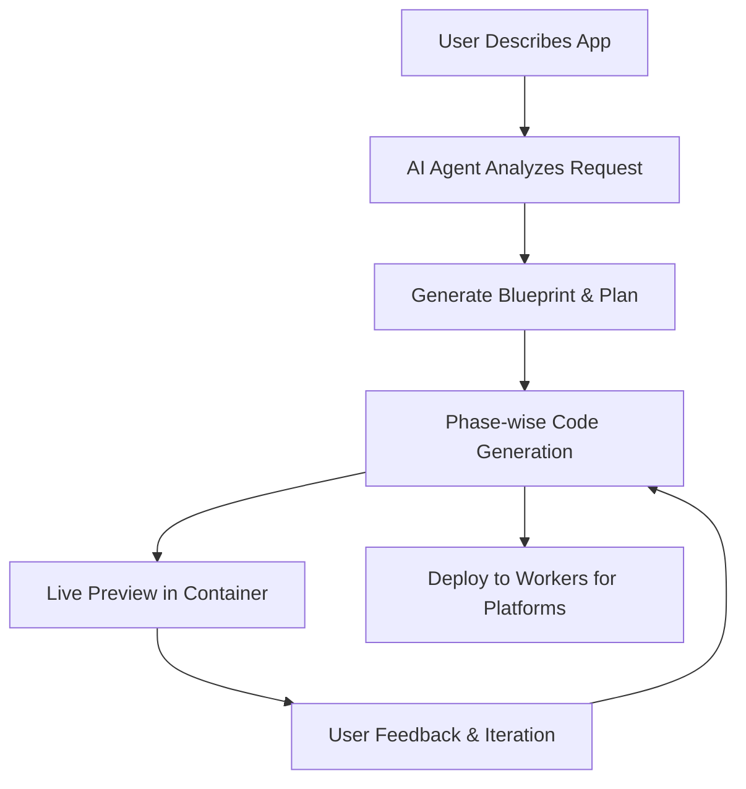

# Reham AI - Next-Generation Vibe Coding Platform

Reham AI is a next-generation Vibe Coding platform crafted to deliver a fully interactive, user-friendly experience for both novice and experienced builders. It pairs a modern dark-themed, responsive interface with a robust, scalable architecture that seamlessly integrates multiple LLM providers, all deployed on Cloudflare-backed infrastructure for reliability and performance.

This repository provides the full-stack foundation for Reham AI, including a Next.js frontend, a FastAPI backend, Supabase integration for auth and data, and Qdrant for semantic search. It is designed for rapid, AI-assisted development while keeping production readiness in focus.

## Product Vision

- **Interactive Vibe Coding**: A guided, real-time environment where users can ideate, prototype, and ship with AI assistance.
- **Modern dark aesthetic**: A sleek UI that is easy on the eyes and visually engaging.
- **Responsive by default**: Optimized for desktop, tablet, and mobile experiences.
- **Multi-LLM architecture**: Supports OpenAI and Anthropic today, with flexible expansion to additional providers.
- **Cloudflare-first scalability**: Built to handle high volumes with consistent performance and low latency.

## Experience Flow



## 🤖 AI-Powered Development

This template includes comprehensive **Cursor Rules** and **Agent Instructions** to supercharge your AI-assisted development:

### Cursor Rules (`.cursor/rules/`)
- **Context-aware guidance** that automatically applies based on the files you're editing
- **Template system** with production-ready code patterns (`@api-endpoint-template`, `@react-component-template`)
- **Best practices enforcement** for FastAPI, Next.js, Supabase, and LLM integration
- **Automatic rule application** - no manual setup required

### AGENTS.md
- **Simplified instructions** for AI coding assistants
- **Project patterns** and common code examples
- **Architecture overview** and development standards
- **Quick reference** for established patterns

### Benefits
- ⚡ **Faster Development** - Templates and patterns accelerate coding
- 🎯 **Consistency** - All code follows established patterns
- 🛡️ **Quality** - Built-in best practices and error handling
- 📚 **Learning** - New developers quickly understand project structure
- 🤖 **AI-Optimized** - Designed specifically for AI coding assistants

## Features

### Backend (Python FastAPI)
- **FastAPI REST API** - Fast, type-checked API development
- **Supabase Integration**
  - Authentication (Google, LinkedIn, Email/Password)
  - Database connectivity
  - Realtime subscriptions
  - Storage management
  - Database migrations
- **LLM Integration**
  - OpenAI and Claude support
  - Abstracted LLM service
  - Vector embeddings service
- **Vector Database**
  - Qdrant integration
  - Document storage and semantic search
  - Automatic fallback to local in-memory database

### Frontend (Next.js)
- **Next.js** - React framework with routing, SSR, and more
- **Tailwind CSS** - Utility-first CSS framework
- **Responsive design** - Mobile-first approach
- **Supabase client** - For auth and data access
- **Complete auth flows** - Login, signup, password reset

## Getting Started

### Prerequisites
- Docker and Docker Compose
- Make
- Node.js 18+ (for local frontend development)
- Python 3.10+ (for local backend development)
- Supabase CLI (for database migrations, install with `brew install supabase/tap/supabase` or see [Supabase CLI docs](https://supabase.com/docs/guides/cli))

### Quick Start (Recommended)

1. Clone this repository:
   ```bash
   git clone https://github.com/humanstack/vibe-coding-boilerplate
   cd vibe-coding-boilerplate
   ```

2. Run the first-time setup script to configure your environment:
   ```bash
   ./first-time.sh
   ```
   This will:
   - Check for required tools
   - Guide you through setting up API keys
   - Generate the necessary .env files

3. Start the development environment:
   ```bash
   make dev
   ```

4. Access the applications:
   - Frontend: http://localhost:3000
   - Backend API: http://localhost:8000
   - API Documentation: http://localhost:8000/docs

### Required API Keys Checklist

Use this checklist to make sure every capability is enabled:

- [ ] **Supabase URL** (`SUPABASE_URL`) - required for auth and data access
- [ ] **Supabase Service Role Key** (`SUPABASE_SERVICE_KEY`) - required for backend server operations
- [ ] **OpenAI API Key** (`OPENAI_API_KEY`) - required for OpenAI-powered LLM features (optional if using Anthropic only)
- [ ] **Anthropic API Key** (`ANTHROPIC_API_KEY`) - required for Claude-powered LLM features (optional if using OpenAI only)
- [ ] **Qdrant URL** (`QDRANT_URL`) - required for vector search (optional if you don't need semantic search)
- [ ] **Qdrant API Key** (`QDRANT_API_KEY`) - required when Qdrant authentication is enabled

## Setup Without Script

If you prefer to set up manually:

1. Copy the `.env.example` file to `.env`:
   ```bash
   cp .env.example .env
   ```

2. Create a frontend environment file:
   ```bash
   cp .env.example frontend/.env.local
   ```

3. Edit both files to add your API keys for:
   - Supabase (required for auth)
   - OpenAI and/or Anthropic (for LLM features)
   - Qdrant (for vector database features, optional)

4. Start the development environment:
   ```bash
   make dev
   ```

## Authentication Setup

For detailed instructions on setting up authentication providers (Google, LinkedIn, GitHub, etc.), see the [Authentication Setup Guide](./AuthSetup.md).

## Structure

```
/
├── .cursor/                  # Cursor AI configuration
│   └── rules/                # Cursor rules for AI assistance
│       ├── backend/          # Backend-specific rules
│       ├── frontend/         # Frontend-specific rules
│       └── templates/        # Code templates
├── AGENTS.md                 # AI agent instructions
│
├── backend/                  # Python FastAPI application
│   ├── app/                  # Application code
│   │   ├── api/              # API endpoints
│   │   ├── core/             # Core functionality
│   │   ├── models/           # Data models
│   │   └── services/         # Service layer
│   │       ├── llm/          # LLM services
│   │       ├── supabase/     # Supabase services
│   │       └── vectordb/     # Vector DB services
│
├── frontend/                 # Next.js application
│   ├── app/                  # Next.js app directory
│   ├── components/           # UI components
│   ├── services/             # API services
│
├── supabase/                 # Supabase configuration
│   ├── migrations/           # Database migrations
│   ├── seed.sql              # Database seed data
│   └── README.md             # Migrations documentation
│
├── llm-context/              # Legacy context files (now replaced by Cursor rules)
├── docker-compose.yml        # Docker configuration
├── Makefile                  # Project commands
├── first-time.sh             # Setup script
├── .gitignore                # Git ignore patterns
├── .env.example              # Example environment variables
├── CHANGELOG.md              # Project changelog
└── FutureImprovements.md     # Future feature roadmap
```

## Common Tasks

### Development

- Start all services: `make dev`
- Frontend only: `make dev-frontend`
- Backend only: `make dev-backend`

### Production

- Start production services: `make prod`
- Frontend only: `make prod-frontend`
- Backend only: `make prod-backend`

### Cleanup

- Clean up containers: `make clean`

### Database Migrations

- Create a migration: `make db-migration-new name=create_table`
- Apply migrations to remote: `make db-apply`
- List applied migrations: `make db-list`
- Check pending migrations: `make db-status`
- Push migrations (same as apply): `make db-push`

See `supabase/README.md` for more details on database migrations.

## AI Development Support

### Using Cursor Rules
The project includes comprehensive Cursor rules that automatically provide context-aware guidance:

- **Automatic Application**: Rules apply automatically based on the files you're editing
- **Template Usage**: Reference templates with `@api-endpoint-template`, `@react-component-template`, `@service-class-template`
- **Best Practices**: Built-in patterns for FastAPI, Next.js, Supabase, and LLM integration

### Using AGENTS.md
For simpler AI assistance, use the consolidated `AGENTS.md` file that provides:
- Project overview and architecture
- Common patterns and examples
- Development standards and workflows

## Documentation

- [Cursor Rules Guide](./.cursor/rules/README.md)
- [AI Agent Instructions](./AGENTS.md)
- [Authentication Setup Guide](./AuthSetup.md)
- [Database Migrations](./supabase/README.md)
- [Project Changelog](./CHANGELOG.md)
- [Future Improvements](./FutureImprovements.md)

### Legacy Documentation (replaced by Cursor rules)
- [Backend Context](./llm-context/BACKEND-CONTEXT.md)
- [Frontend Context](./llm-context/FRONTEND-CONTEXT.md)
- [Database Migrations Context](./llm-context/DB-MIGRATIONS.md)
- [Supabase SDK Reference](./llm-context/SUPABASE-CLIENT-SDK.md)

## License

MIT
